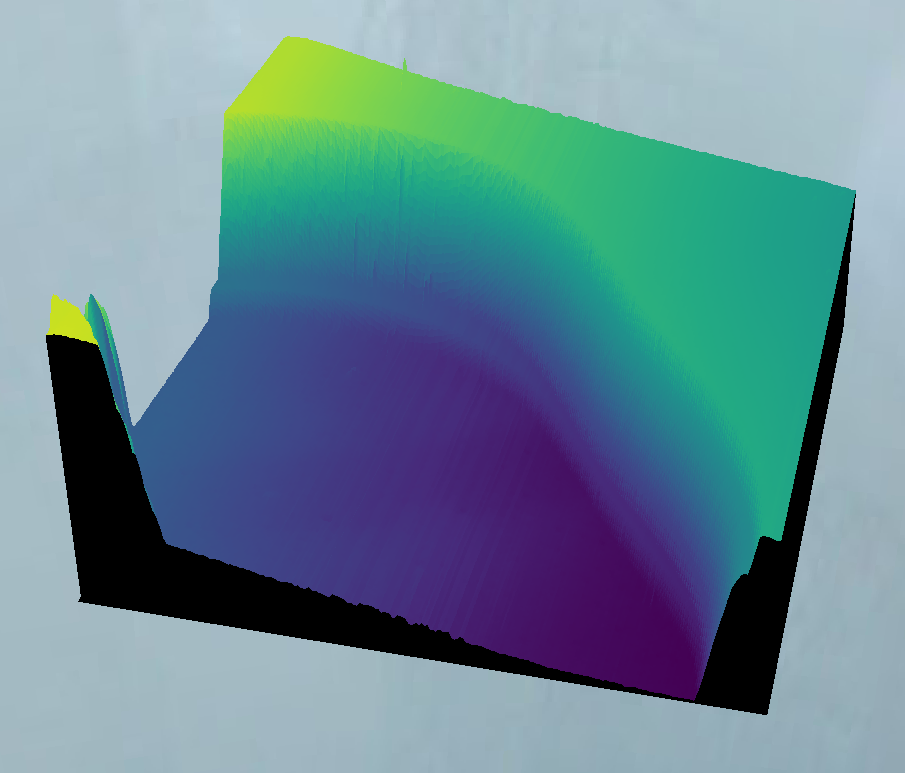

# fp-afm
Move around an atomic force microscopy scan in first person.
Unfortunately, collisions are not working yet.
I am unsure if collisions are possible with the images from [Gwyddion](http://gwyddion.net/).
Probably it is possible by exporting from [Gwyddion](http://gwyddion.net/) to STL and then importing into Blender to create a scene.
Alternatively, collisions can be detected manually based on the image itself.

## Prepare data
Export your data as a PNG from [Gwyddion](http://gwyddion.net/).
It is import that you do *not* check the `export as grayscale option`.
Instead just select all the options such that no scale bars are displayed.
I recommend working with the height data from contact mode as that will provide the smoothest surface to move on.

## Colored height maps
If you want colored height maps, you can export two files from [Gwyddion](http://gwyddion.net/).
The first is the default image as described above which will be grayscale.
Then you can change to another color scale and export again.
This time save the file identically except append *-color.png* to whatever your original stem was.
The script will detect this automatically and color the terrain appropriately.

## Controls
This operates on Minecraft creative-mode flight controls:

- Use the mouse to look around.
- Use WASD to move forward/left/back/right.
- Holding shift will cause you to descend.
- Holding space will cause you to ascend.
- Escape opens the menu where you can either quit or load another surface.

## Installation
This is a very simple Python script that only depends on the [Ursina game engine](https://www.ursinaengine.org/).
You can use `pip3 -r requirements.txt` to install required packages.
